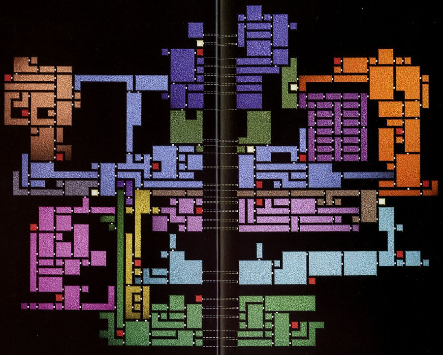
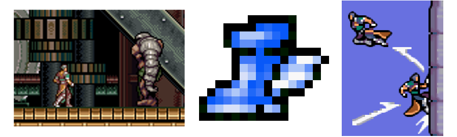
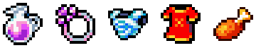
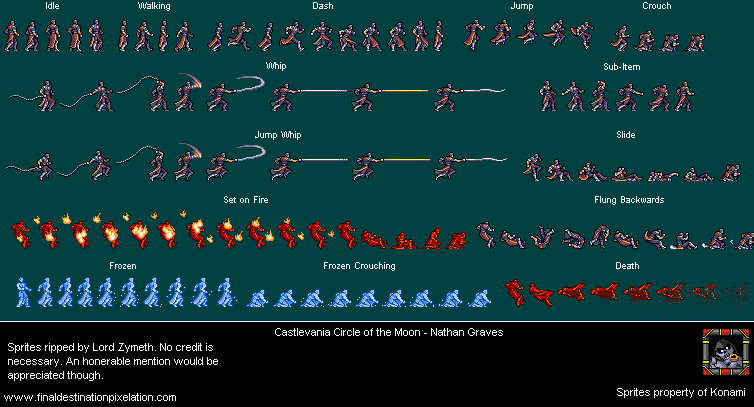
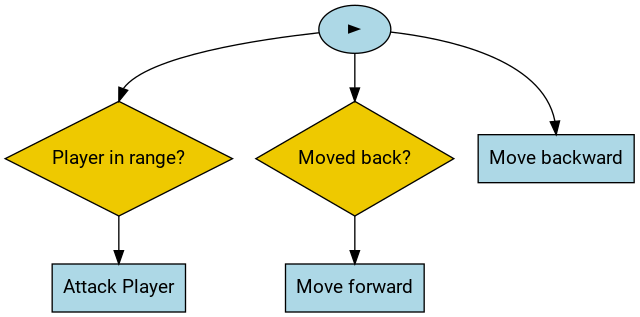
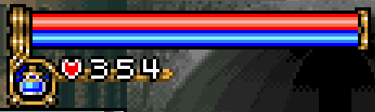
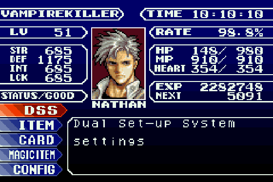
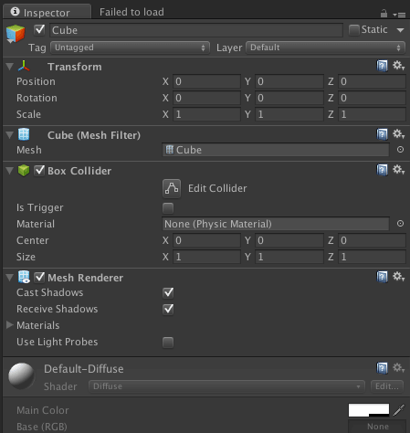
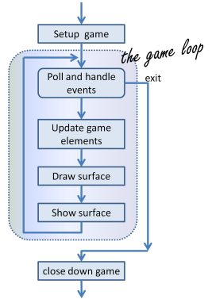

# Metroidvania Specification

As the title already suggests, the ultimate goal is to create a small, *[Metroidvania](https://en.wikipedia.org/wiki/Metroidvania)-like* side-scroller.
If you are not familiar with games falling into the Metroidvania genre – or side-scrollers in general – I recommend having a look at these titles:

- [Castlevania: Symphony of the Night](https://en.wikipedia.org/wiki/Castlevania:_Symphony_of_the_Night)
- [Castlevania: Circle of the Moon](https://en.wikipedia.org/wiki/Castlevania:_Circle_of_the_Moon)
- [Super Metroid](https://en.wikipedia.org/wiki/Super_Metroid)
- [Ori and the Blind Forest](https://www.gog.com/game/ori_and_the_blind_forest_definitive_edition)
- [Dust: An Elysian Tail](https://www.gog.com/game/dust_an_elysian_tail)
- [Salt and Sanctuary](https://store.steampowered.com/app/283640/Salt_and_Sanctuary/)
- [Owlboy](https://www.gog.com/game/owlboy)
- [Guacamelee](https://www.gog.com/game/guacamelee_gold_edition)
- [Hollow Knight](https://www.gog.com/game/hollow_knight)
- [Iconoclasts](https://www.gog.com/game/iconoclasts)
- [Dead Cells](https://www.gog.com/game/dead_cells)
- [**Timespinner**](https://store.steampowered.com/app/368620/Timespinner/)

After playing some gam-… ehh… doing some research, you should be familiar with the core game concepts and mechanics of the genre.

Before moving on, I want you to make up your minds about the setting your game takes place in.
While a medieval fantasy world with demons and vampires sounds straight forward, don't overlook other possibilities like cyberpunk, steampunk, post apocalypse and so on.
Determine upfront whether you are going for a more serious or a more humorous tone – whether things should be realistic or over the top with crazy anime effects everywhere.

Now that a certain setting has been established, continue the read and imagine what the equivalences to my examples would be in your game.
These equivalences can often be derived directly from the chosen setting.
However, you might want to throw in a twist here and there to surprise the player and keep her engaged.

Most of the examples presented in the following sections are taken from *Castlevania: Circle of the Moon*.
This way I can stick to a common setting throughout.

### Assets

That's nice and stuff, but what about all the assets (eg sprites, music, sound effects) that are required for such a game?

Well, you don't have to look far.
As this is still about learning C++, I don't expect you to spend your precious time on creating all of them by hand.
There are megatons of assets for free- / non-commercial- / educational-use available online.
I am pretty sure you'll find something among them which suits your setting.
Maybe some slight modifications are needed here and there, but nothing that should distract you from learning C++.

For various types of assets – sound effects especially – there are also generators available which can be tweaked for unique results.
Pick your poison!

## Building the World

Metroidvania style games are typically semi-open world.
While the player can explore the game world freely, certain areas are gated off at the start.

Let's take a look at this map.



*source: http://castlevania.wikia.com/*

It displays the whole layout of the castle – each wing (aka section or area) coloured differently.
Each of the polygons represents a room, which in turn is connected to other rooms, and is associated with one of the wings – here indicated by its colour.
The small, red rooms are save points; while the small, white rooms are teleporters.

Each wing is unique in the architecture of the rooms, the enemies encountered, the background music, the items obtained, and so on and so forth.

The player needs to face off the vicious boss of a wing in order to progress.
After defeating such a boss, a new item or ability is acquired which grants her passage to other, previously inaccessible, wings of the castle.

Here is an example:



*source: http://castlevania.wikia.com/*

The final boss of the *Machine Tower* is the *Iron Golem* (left).
From it, the player obtains the *Kick Boots* (centre) which enables jumping off walls to gain more height (right).
With them, the *Chapel Tower* can now be accessed.

### Implementation

A room essentially consists of a 2D array of tiles.
Together, the tiles build the floor, ceiling, and walls of the room.
Platforms are added to enable vertical traversal.
For additional depth, an image is rendered behind the layer of tiles, which is sometimes panned as the camera moves – similar to a skybox in 3D games.

Game entities (eg items, enemies, doors) can be placed via XY coordinates.
The doors are particularly important as they are responsible for interconnecting rooms.

The layout of each room in your game should be fully determined by a single file – preferably human-readable.
It *could* look like this:

```
MAP Room01
BACKGROUND assets/images/background/library.png
MUSIC assets/music/ancient_tomb.ogg
TILES
  . = none
  w = Wall01
  c = Ceiling01
  f = Floor01
  p = Platform01
LAYOUT
  wcccccccccccccccccw
  w.................w
  w.................w
  w..........ppp....w
  w.................w
  w.................w
  fffffffffffffffffff
ENTITIES
  ( 2, 5) Player()
  ( 8, 5) Enemy_BookTossingRedneck()
  (12, 2) SmallHealthPotion()
  (18, 5) Door01_right(Room01_exit, Room02_entry)
```

Tiles and game entities are defined elsewhere, yet some of them require arguments for their instantiation.
In this example, the door gets a designation (`Room01_exit`) and is connected to some other door (`Room02_entry`).

## Hearing the World

Commonly, the music playing is either determined by the room or wing.
The selected tune is repeated until a room / wing with different background music is entered.

A more advanced technique is to use different variations of the same background music and blend them together depending on the situation.

For instance:
the player enters a room, no enemy in sight;
a *softer* version of the tune is playing.
As the player progresses through the room, enemies awake and engage the player;
the tune becomes more dramatic.
One of the enemies lands a devastating blow, depleting the player's health bar almost entirely;
a *high tension* version fades in – additionally the player's low health causes an annoying alarm to be played.

### Implementation

SDL_mixer is probably all you need for this.
It provides separate sound channels, each with its own volume setting.

One simple way to blend variations of the same track is by playing all of them on separate channels and adjusting the volume accordingly.

Obviously, sound effects are played on different channels than background music so they do not interfere.

## Entities of the Game

Having rooms and wings would be a bit pointless without anything that interacts with it, wouldn't it?

All of the objects in your game are referred to as entities.
Entities interact with the game world as well as with each other.
Their complexity varies greatly, from a simple key that can be picked up to unlock doors, to AI controlled enemies.

Most of them are visible (rendered) and have collision so they can be interacted with.
Others may be almost unnoticeable by the player – like a point in 2D space which just emits a screeching noise.

Typically, entities have a position, rotation, scale, and a type; the latter may come with additional state and ways of interaction.
A more complex alternative for typing entities is by using an entity component system (see below).

### Rendering

Displaying (static) entities is straight forward.



*source: https://strategywiki.org/wiki/Castlevania:_Circle_of_the_Moon*

[Sprites](https://en.wikipedia.org/wiki/Sprite_(computer_graphics)) are essentially bitmap images with transparent background.
The position, rotation, and scale for rendering the sprite is determined by the position, rotation, and scale of the entity respectively.
Offsets may be added, but apart from that, that's it.

### Animation

More dynamic entities, like the player character (PC) or enemies, often feature animations.
These start with simple idle and walking animations, but can also turn into breathtaking combat and dodging choreographies.



*modified: removed middle part for brevity*

The key idea is to use multiple sprites instead of just one.
Each animation frame is a new sprite.
When an animation is played, the related sprites are displayed one after another to simulate motion.

Multiple sprites are combined and put into the same image, which is then called a *sprite map*.
The rendering API allows us to select which part of the image to use for rendering.
A simple rectangle selection is used to pick the sprite for the current frame.

#### Implementation

Composing a sprite map is trivial, yet we are still missing some information.
Namely, where exactly the sprites are located in the sprite map, which animation they belong to, and how long each sprite should be displayed before it is swapped out.

This can be solved via a simple text file.
Like with the room layout, determine the format yourself, preferably human-readable.
A hypothetical example is provided:

```
ANIMATION Enemy_BookTossingRedneck
SPRITES assets/images/sprites/enemies/book_tossing_redneck.png
ITEMS
  idle       0ms ( 0,  0) (16, 16)
  drinking   0ms (16,  0) (32, 16)
  walking  500ms ( 0, 16) (16, 32)
                 (16, 16) (32, 32)
                 (32, 16) (48, 32)
                 (48, 16) (64, 32)
```

First we state to which entity the animation file belongs and where the corresponding sprite map can be found.
It consists of 6 sprites, the first two are displayed when the entity is idling or drinking respectively.
As both only consist of a single sprite, the timing is irrelevant and therefore set to zero.
For the walking animation, we use 4 sprites and state that one period takes 500 ms, hence each sprite is displayed 125 ms before getting swapped out.
After the forth sprite has been displayed, the animation loops, starting over with the first sprite.

### Collision

So far we can display the game world and entities – even with animations – yet we still lack basic interaction.
This is where collision comes in.
Whenever one entity collides with the room layout (walls, floors, platforms etc) or another entity, this needs to be recognised so the associated logic can be triggered.

If the player runs into a wall, the wall should of course stop the player and prevent her from running out of bounds.
Similarly, an enemy projectile hitting the player should cause a hit animation to be played along with a sound effect and decreasing the player's health.

#### Implementation

There are various different ways one can implement collision for 2D side-scrollers.
All of them come with their own benefits and drawbacks.
I'll leave things for you to decide.

## Stats

Sometimes Metroidvania-like games implement mechanics originating from role-playing games (RPGs).

A prime example is the introduction of stats.
Rather than having fixed values for weapon damage, health, damage resistance etc; the actual values are computed by taking a base-value and scaling it.
This scale factor is determined by the entity's stats (aka attributes).

These stats change over the course of the game.
Typically, the player character's stats are improved by earning experience points (XP) and levelling up.
Experience is often earned by slaying enemies, completing quests, and alike.

Even further, entity stats can be influenced by items (eg *speed boost elixir*), gear (eg *boots of strength*), spells (eg *improved fire resistance*), conditions (eg *cursed*), and the list goes on and on and on.

## AI

Enemies just standing around, doin' nothing ain't particularly interesting.

Even very simple and deterministic AI can be sufficient.
Like:

```cpp
void do_something()
{
	static bool moved_forward = true;

	if (player_in_range()) {
		attack_player();
		return;
	}

	if (moved_forward) {
		move_backward();
	} else {
		move_forward();
	}

	moved_forward = !moved_forward;
}
```

Additionally, one can add randomness to make enemies less predictable.
For instance: one out of ten times, use a different attack which is faster and does more damage.

Leverage randomness and other factors to create interesting boss AIs.
The distance to the player could determine which kind of attack the boss uses.
The player's health could dictate how aggressive the boss becomes.
The number of possibilities is endless.

### Implementation

For simplicity, the AI can be hardcoded in the logic of an enemy.

Alternatively, you may want to look into [behaviour trees](https://en.wikipedia.org/wiki/Behavior_tree_(artificial_intelligence,_robotics_and_control)).



## HUD and Menus

The head-up display (HUD) is a crucial component as it conveys important information to the player.
In Castlevania, the health- and mana-bar can be found in the top-left corner of the screen, along with the secondary weapon, and ammo.



*source: http://castlevania.wikia.com*

Not all aspects of the game can be done (reasonably) by moving the player character around.
Certain tasks require a menu system.
This starts at the main menu of the game, along with the pause and option menus.



*source: https://strategywiki.org/wiki/Castlevania:_Circle_of_the_Moon*

The pause menu displays the players stats (health, attributes, experience etc) and provides access to various submenus – inventory management among them.

### Implementation

SDL provides basic shape drawing functionality.
With it, you can easily build an abstraction layer for creating rudimentary user interface (UI) components.
Alternatively, you can simply use images.

SDL_ttf allows you to use fonts for printing text.
Please supply used fonts along with all assets.

## Entity Component System

Many modern game engines use an architecture known as [entity component system (ECS)](https://en.wikipedia.org/wiki/Entity%E2%80%93component%E2%80%93system).
While this paradigm is probably overkill for a small project like this, you may scavenge some of its ideas.

In ECS, entities are just containers for components.
Components, however, determine how the associated entity behaves, how it can be interacted with, and so on.

Take the player entity for a moment, in terms of the ECS architecture, it would have:

- a component for rendering sprites
- a component which deals with animations
- a component which emits sound
- a physics collider or bounding box
- a component which models health
- …

You basically create a huge toolbox of little things (components) that can be mixed and matched to compose a full-blown entity.



The figure above shows the inspector window of the [Unity](https://unity3d.com/) editor.
The inspector displays the components attached to the selected entity.
Here, the entity named *Cube* consists of a *Mesh Filter*, *Box Collider*, and *Mash Renderer* component.
The *Transform* is part of the entity itself and gives it its position, rotation, and scale.
As can be seen from the screen-shot, each component possesses properties that can be tweaked, like, the material used for mesh rendering.

This leaves us with the *system* part.
Each system (audio system, physics system, rendering, *whatever you can think of*) interacts with the associated components possessed by entities.

## Main Game Loop

Often, in addition to ECS, games use the *main game loop* paradigm.
In combination with ECS this is commonly presented as a straightforward sequence:

1. Take the current game state.
2. Invoke all systems.
   Each system generates events based on the game state.
   For instance, one event indicates that the jump button is pressed, another that two entities collide, and so on.
3. Gather emitted events in a queue.
4. Process each event one after another, mutating the game state.
   Upon exhausting the queue, the next game state is reached.
5. Move on to rendering.
6. `goto 1`

See also this figure, taken from *[How to Think Like a Computer Scientist](http://openbookproject.net/thinkcs/python/english3e/index.html)*:



However, what looks easy on paper can be rather challenging in reality.
First, certain events may stay in conflict with each other.
Like, while the player character should move upwards because of the jump button being pressed, a projectile may hit her in the exact same frame which causes knock-back.
Now, do you move the player up, or away from the projectile due to knock-back?
Or both?
And what if a wall is there preventing the player character from being pushed in this specific direction.

Even in this tiny example, the order in which events are processed matters.
They may even build circular dependencies with each other.

As it turns out, such an *invoke everything first, ask questions later* approach comes with a lot of problems.
One way to improve upon this is by doing stuff in phases, plus ensuring that the modified game state is always valid.

The whole topic of game engine architecture is huge and most decisions are trade-offs.
I recommend that you try not to over-think this.
Keep your cool and experiment until you find something that kinda works.

## Debugging

Develop debugging utilities as early as possible.
Consider the following:

- log output
- show bounding boxes, game entity positions, damage numbers etc; on screen
- *noclip* (disable collision + player can fly)
- *god mode* (player doesn't take any damage)
- infinite ammo / mana / resources
- spawning entities in front of the player
- directly load a specific map
- goto x y
- …

Another helpful technique is the use of fallback assets.
Let's say, a certain sprite cannot be loaded for whatever reason.
Instead of crashing the application with a cryptic error code, log a warning and use an *error sprite* instead.

- - -

## Goals (11 Points)

- (2) two consecutive areas, each:
    - with its own tone (architecture, sprites, music, enemies etc)
    - with a handful of rooms each
    - a boss guarding an item / ability
- (2) basic movement
    - running left / right
    - jumping
    - interacting with game entities (doors, chests etc)
- (1) save / load with dedicated save points (rooms)
- (1) one or more advanced movement mechanics
    - eg double jump, wall jump, sliding
    - needs to be unlocked
- (1) main combat
    - melee and/or ranged
    - hitting enemies
    - getting hit by enemies
- (2) enemies
    - attack the player character as it gets in range
    - variants with melee attacks
    - variants with ranged attacks
    - bosses are capable of using different attacks
- (1) map
    - shows discovered rooms and their doorways
    - shows discovered save points
    - shows where the player is currently located
- (1) menus
    - main menu
        - new game
        - load game
        - exit
    - pause menu
        - shows player stats
        - inventory management
        - continue
        - go to main menu
    - game over
        - player dies
        - player defeats final boss
