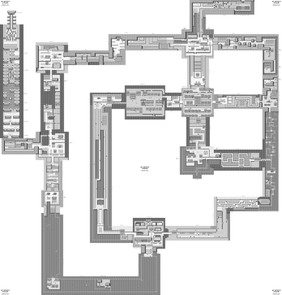
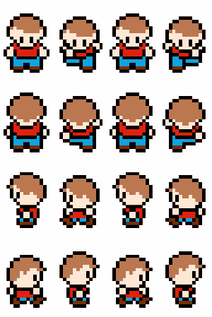

# RPG Specification

We describe a simple 2D RPG with two layers.

The first layer is an interactive *overworld* which is explored by the player.
There, the player can talk to other characters and manage their resources (items, equipment, …).

The second layer is a turn-based combat system as typically found in JRPGs.

For references, have a look at these titles / series:

- Octopath Traveler
- Final Fantasy
- Chrono Trigger
- Pokémon
- Persona
- Trails of Cold Steel

After playing some gam-… ehh… doing some research, you should be familiar with the core game concepts and mechanics of the genre.

Before moving on, I want you to make up your mind about the setting your game takes place in.
While a fantasy world with magic and monsters sounds straight forward, don't overlook other possibilities like cyberpunk, steampunk, post apocalypse and so on.
Determine upfront whether you are going for a more serious or a more humorous tone — whether things should be realistic or over the top with crazy anime effects everywhere.

### Assets

But, what about all the assets (sprites, music, sound effects, …) that are required for such a game?

Well, you don't have to look far.
As this is still about learning C++, I don't expect you to spend your precious time on creating all of them by hand.
There are megatons of assets for free- / non-commercial- / educational-use available online.
I am pretty sure you'll find something among them which suits your setting.
Maybe some slight modifications are needed here and there, but nothing that should distract you from learning C++.

For various types of assets — sound effects especially — there are also generators available which can be tweaked for unique results.
Pick your poison!

## Building the World

As already mentioned, the first layer of your game is an overworld where the player interacts with other characters and so on.
This overworld is typically composed of safe-zones (like villages or small settlements) and wilderness where enemies are encountered.
Often, certain sections of the overworld remain gated off until the player has advanced far enough into the story.

Here is the overworld of Pokémon Red and Blue (1996)

### Overworld Implementation

A 2D array of tiles can be used to describe the map itself.
Entities (characters, chests, enemies, …) can be added by simply stating their coordinates.

I recommend to put the world definition into a dedicated file, following a human-readable, easy-to-parse file-format.
Alternatively, just put the definition in your code.

## Viewing the World

[Sprites](https://en.wikipedia.org/wiki/Sprite_(computer_graphics)) are essentially bitmap images with transparent background.
They are used for everything that needs to be displayed.

The *transform* (position, rotation, scale) of an entity determines where and how the corresponding sprite is rendered.

### Animations

Dynamic entities, like the player character (PC) or enemies, often feature animations.
These start with simple idle and walking animations, but can also turn into breath-taking combat and dodging choreographies.

The key idea is to use multiple sprites instead of just one.
Each animation frame is a new sprite.
When an animation is played, the related sprites are displayed one after another to simulate motion.

Multiple sprites are combined and put into the same image, which is then called a *sprite map*.
The rendering API allows us to select which part of the image to use for rendering.
A simple rectangle selection is used to pick the sprite for the current frame.

## Hearing the World

Commonly, the background music is either determined by the section of the overworld or enemy encounter (regular battle theme, boss battle theme, …).
The selected tune is repeated until the player moves to a new section or finishes the encounter.

A more advanced technique would be to use different variations of the same background music and blend them together depending on the situation. Say, switch to a more tense version of your regular battle theme as soon as the player's combatants are low on health.

### Audio Implementation

SDL_mixer is probably all you need for this.
It provides separate sound channels, each with its own volume setting.
Sound effects are played on different channels than background music so they do not interfere.

If you wanna go for something fancy, with more features, have a look at [OpenAL].

## Interacting with the World

Most interaction between the player and the game world is done through message boxes and menu systems.
For this, you need to implement some basic UI system.
You already know how to render sprites, font support is available via [SDL_ttf].

### Interaction Implementation

Often, a scripting engine is added to the game engine for scripting the interactions between characters, combat, and so on.
However, this goes beyond the scope of this project.

My recommendation is to simply hard-code the logic and script of your game in C++.
Think about creating your own little embedded domain-specific language (EDSL) on top of C++.
Consider trying [Boost Coroutine](https://theboostcpplibraries.com/boost.coroutine) for adding asynchronous programming paradigms.

## Story

Again, the focus of the side project lies on learning C++.
Your RPG should feature a short story with a twist near the end.
Nothing fancy, just something to keep the player interested while exploring the overworld.

## Combat AI

Similar to your other game logic components, the combat AI may be hard-coded in C++.
[Behaviour trees](https://en.wikipedia.org/wiki/Behavior_tree_(artificial_intelligence,_robotics_and_control)) are often utilised for creating game AI.
Maybe give them a try.
Consider adding randomness to your decision making progress to make enemies less predictable.

## Debugging

Develop debugging utilities as early as possible.
Consider the following:

- Log output
- Show details (positions, damage numbers, decision making process, …) on screen
- *God mode* (player's combatants can't die)
- Infinite resources (items, spells, …)
- …

Another helpful technique is the use of fall-back assets.
Let's say, a certain sprite cannot be loaded for whatever reason.
Instead of crashing the application with a cryptic error code, log a warning and use an *error sprite* instead.

---

## Goals (11 Points)

- (2) Overworld with 2 different sections:
  - Each with its own tone (architecture, sprites, music, enemies, …)
  - The second is only accessible after some story progress
  - Player can roam the world and interact with other entities
- (1) Characters
  - Player can talk to other characters
- (1) Resources
  - Player can manage acquired resources through dedicated menus
- (1) Stats
  - Player's combatants have stats that influence the combat
  - Player's combatants get experience from combat, increasing their stats
  - Stats are influenced by equipment
- (3) Combat
  - Turn-based
  - Player selects which attacks, spells, items, etc. to use on which target
  - Enemies use attacks, spells, items, etc. to combat the player
  - *Game Over* when all of player's combatants are dead
- (1) Save points
  - Player can save her progress at specific points in the game
  - Saved progress is persistent across play sessions (application termination)
- (1) Audio
  - Background music
  - Sound effects
- (1) Main menu
  - New game
  - Load game
  - Exit
