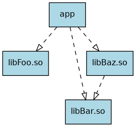

# Exercises

## Task 01

Install G++ and Clang, then compile the provided file [`hello.cpp`](task01/hello.cpp).
Use the following flags when compiling:

    -std=c++17 -Wall -Wextra -O2

Next, set up [Boost](http://www.boost.org/) on your system and compile the provided file [`hello_boost.cpp`](task01/hello_boost.cpp).
Boost is quite common and provides you a set of useful C++ libraries.
Some of its content is even promoted into the C++ standard library.

## Task 02

Run Clang on the provided file [`vec.cpp`](task02/vec.cpp) using the following command:

    clang -std=c++17 -Xclang -ast-dump -fsyntax-only -Wno-vexing-parse vec.cpp

Clang will parse the input file and display its abstract syntax tree (AST).
In the bottom half of the output you'll find the function declaration of `main` followed by its `CompoundStmt`.
Take a close look at its children and compare the resulting AST with the input code.
Notice any oddities — something that looks counter intuitive?

As you can see, there are multiple different ways of initialisation in C++.
Check out the [corresponding section at cppreference](https://en.cppreference.com/w/cpp/language/initialization).

## Task 03

The directory [`task03`](task03) hosts four subdirectories, `libFoo`, `libBar`, `libBaz`, and `app`.

Each folder prefixed with `lib` represents a library and contains a header plus a source file.
Furthermore, the library `libBaz.so` depends on `libBar.so`.

`app` contains a single source file providing a `main` function.
It depends on all three libraries.



- Model this project structure using [CMake](https://cmake.org/)
- Be sure to set the C++ standard to C++17 and enable warnings (`-Wall -Wextra`)
- The default build type should be *Release*

CMake itself is a build system generator.
You can choose from a variety of target build systems.

## Task 04

Examine the program [`iterations.cpp`](task04/iterations.cpp) and think about the expected output.
Compile the program and run it.
What do you notice?
Did you expect this behaviour?
Did you get any compiler warnings?
Investigate what is actually happening (consider using `valgrind` or a debugger).

How can such errors be prevented?
Look for tools (e.g. static code analysers) which help discovering such faulty code.

**Note:** If you run the executable and everything seems normal, try changing the initial content of `xs`, using different optimisation flags, or a different compiler.
The actual behaviour of this executable depends on various factors.

See [Iterator Invalidation](https://en.cppreference.com/w/cpp/container#Iterator_invalidation).

## Task 05

You are given the program [`strange.cpp`](task05/strange.cpp).
Compile it with different compilers and optimisation flags.
What do you notice?
What is really happening here?

See [Undefined Behaviour](https://en.cppreference.com/w/cpp/language/ub) and [Defining the undefinedness of C](https://dl.acm.org/citation.cfm?id=2737979).

## Task 06

This task focuses on the correct implementation of RAII as well as copy and move semantics.
You are asked to implement the concept of `unique_ptr` and `shared_ptr`.
Since we won't concern ourselves with templates for the moment your implementation will *own* an instance of the following `struct`.

```cpp
struct Vec2 {
    float x, y;
};
```

- Read the documentation regarding *smart pointers*, `unique_ptr`, and `shared_ptr`
- Implement your version of `unique_ptr_to_vec2` and `shared_ptr_to_vec2` fulfilling these requirements:
  - *Dynamically* allocate an instance of `Vec2` in your constructor
  - De-allocate the `Vec2` instance in your destructor
  - Implement correct copy semantics (copy constructor / copy assignment)
  - Implement correct move semantics (move constructor / move assignment)
  - Enable access to `Vec2` via the operators `*` and `->`
  - Thread-safety for `shared_ptr_to_vec2`'s reference counter is not required
  - Pay attention to corner-cases like self-assignment (`v = v`)
- Prepare a few interesting test cases
- Check your implementation for memory leaks and memory corruptions using `valgrind` and sanitizers

See [Rule of Three](https://en.wikipedia.org/wiki/Rule_of_three_(C%2B%2B_programming)).

## Task 07

Read [this blog post](https://www.gamedev.net/blogs/entry/2265481-oop-is-dead-long-live-oop).

- Pay attention to *implementation vs. interface inheritance*
- Pay attention to the use of templates (assuming you've already covered them)
    - Think about the benefits and drawbacks of the used patterns

## Task 08

You are given the following definition of a person:

```cpp
struct Person {
    std::string firstname;
    std::string lastname;
    int age;
};
```

- Implement relational operators (`<`, `<=`, `>`, `>=`)
- Implement comparison operators (`==`, `!=`)

Next, create 5 different instances and put all of them
- in an `std::vector`;
- in an `std::set`; and
- in an `std::map` as key (we don't care about the value type of the map).

Use algorithms from the standard library, like `std::find` and `std::partition` on these containers and examine which operators are used.

**Hint:** You may want to have a look at `std::tie`.

## Task 09

Reuse `Person` from Task 08 and implement the necessary parts for inserting it into an `std::unordered_set`.

Compare the performance of:

- `std::vector`
- `std::list`
- `std::set`
- `std::unordered_set`

## Task 10

Have a look at [this](https://bollu.github.io/mathemagic/declarative/index.html).
Now, do that in C++!

Utilize lambdas, `std::function`, and/or structs with call operators.
Critically think about ownership and minimize the amount of heap allocations.

## Task 11

Take a look at [Boost's chat server example](https://www.boost.org/doc/libs/1_74_0/doc/html/boost_asio/examples/cpp11_examples.html#boost_asio.examples.cpp11_examples.chat).
Try to understand how the session's lifetime is managed by the server.
Focus on `std::enable_shared_from_this` in combination with lambda captures.

## Task 12

Reuse `Person` from Task 08 and take the following, incomplete definition of a room:

```cpp
class Room {
  public:
    Room(int id, size_t limit) : id(id), limit(limit) {}

    // Returns true iff the person successfully entered.
    bool enter(/* Person */) {}

    void exit(/* Person */) {}

  private:
    const int id;
    const size_t limit;
    std::vector</* Person */> peopleInside;
};
```

`Room` contains a list of people currently located inside.
People can enter and exit the room via the respective member functions.
However, at most only `limit` people may be inside at any given time (invariant).

- Add the missing pieces, paying special attention to the types

The following use cases need to be covered next:
- Asking a `Room` how many people are currently located inside
- Asking a `Room` whether a specific person is currently located inside
- Iterating over all people currently located in a `Room`

Implement whatever is necessary to support these use cases, making sure the invariant remains intact.

## Task 13

Reuse `Person` from Task 08.

Create an `std::vector<std::shared_ptr<Person>>` with at least 3 different elements.
Create a function which takes a `const std::vector<std::shared_ptr<Person>>&` as input and returns an `std::vector<Person*>`.
Each element in the result vector corresponds to the respective element in the input vector.

For the functional programming nerds, the definition of this function would be something like `fmap std::shared_ptr::get`.

Write your function in different ways and compare the readability:
- use a range-based for loop
- use `std::transform`
  - use a lambda expression
  - use `std::mem_fn`

Think about taking the argument by value instead of taking it by const reference.

## Task 14

Implement your own version of `std::vector` without using any of the provided containers — use *regular arrays* (`new[]` / `delete[]`) to house your elements.
The focus of this task lies on the use of templates and implementation of iterators.
You do not have to concern yourself with custom allocators.

Test your implementation with different types (`int`, `double`, and a custom struct).

Take your vector from task 1 and implement iterators.
You might want to read through the respective documentation.

Write some tests utilising algorithms provided by the standard library to check if your iterators behave correctly.

## Task 15

Take your vector implementation from Task 14 and instantiate it with a big number of unique types.

Inspect the relationship between the number of unique instantiates and compile time.
Furthermore, look at the compiled object file using `nm`.

## Task 16

In this task you have to create a rudimentary plugin system.

You are given `plugin.hpp` which contains an interface for your plugins, as well as the function name of the constructor function and its type.
Note that the constructor function returns an `std::unique_ptr<Plugin>`.

- create an executable which *dynamically* loads plugins and executes their `run` member function
- create two different plugins (`foo` and `bar`) showing off the plugin system

It could look like this:

    $ ./main ./libFoo.so
    Creation of first plugin
    Running the first plugin
    Destruction of first plugin

    $ ./main ./libFoo.so ./libBar.so
    Creation of first plugin
    Running the first plugin
    Destruction of first plugin
    Creation of second plugin
    Running the second plugin
    Destruction of second plugin

**Hint:** Have a look at the related man-pages *dlopen(3)* and *dlsym(3)*.

## Task 17

Take your vector from Task 14 and implement component-wise addition via `operator+` on your vector.
Support implicit type conversions: `MyVector<int>{} + MyVector<double>{}` yields a `MyVector<double>`.

**Hint:** Look into `decltype` and `std::declval`.

## Task 18

You are given the following code snippet of a mathematical vector.

```cpp
template <std::size_t N>
class Vector {
  public:
    /* ... */

  private:
    std::array<double, N> data;
};
```

Find an elegant way to provide the following interface:

- On default construction (no arguments), all elements are initialized to zero.
- Besides copy / move semantics, there is only one additional constructor which takes *exactly* `N` `double`s to initialize `data`.
- Accessing elements via the subscript operator `operator[]`.
- Members `.x`, `.y`, `.z` access `data[0]`, `data[1]`, `data[2]` respectively:
    - With `N == 1` there should be only `.x` available.
    - With `N == 2` there should be `.x` and `.y` available.
    - With `N == 3` there should be `.x`, `.y`, and `.z` available.

Add a few tests to ensure correct behavior using the following aliases:

```cpp
using Vec1 = Vector<1>;
using Vec2 = Vector<2>;
using Vec3 = Vector<3>;
```

**Note:** You are allowed to modify the given snippet as necessary.

## Task 19

Revisit the meta programming example from the lecture regarding `std::tuple`.

Given the following class template:

```cpp
template <typename... Types>
class type_set {};
```

`type_set` should behave like a set of types.
The empty set would therefore be `type_set<>`, while the set containing the type `int` would be `type_set<int>`, so on and so forth.

- Create a meta function `type_set_contains_v` which checks if a given `type_set` contains a given type.
- Create a meta function `type_set_is_subset_v` which checks if a given `type_set` is a subset of another given `type_set`.
- Create a meta function `type_set_is_same_v` which checks if a given `type_set` is equal to another given `type_set`.
- Create a meta function `type_set_size_v` which tells the size of a given `type_set`.
  For `type_set<int, int, float>` it should return 2.

Try not to use any of the utilities provided by the standard library (like the example provided in the lecture).

**Hint:** If you are struggling with this exercise you might want to have a look at how *fold* (i.e. *reduce*) is used in functional programming languages.

## Task 20

Revisit the *Advanced Template* slides.

Go through the `has_print_to` example from the slides step by step.
Explain all parts like it's done in the lecture.

## Task 21

Take a look at [Boost Operators](https://www.boost.org/doc/libs/1_74_0/libs/utility/operators.htm).
Try to understand *why* the *curiously recurring template pattern (CRTP)* is used.

## Task 22

You are given the code and build instructions for a shared library and an executable which uses the shared library.
The shared library features two functions `random_number` and `just_a_print` inside the `foo` namespace.

Your task is to create an *interceptor* library:

- `random_number` should be replaced with a function that always returns `4` for improved determinism
- `just_a_print` should be wrapped so that some text is printed before and after the original function is executed

Running the executable with and without the interceptor library could look like this:

```
$ ./executable
Random Number: 880806932

Just a print to stdout, nothing else

$ LD_PRELOAD=$PWD/interceptor.so ./executable
Random Number: 4

some text before
Just a print to stdout, nothing else
some text after
```

**Hint:** For Linux, have a look at the related man-pages, like *ld-linux(8)*.

## Task 23

Implement a simple calculator using either [imgui](https://github.com/ocornut/imgui), [Qt Widgets](https://doc.qt.io/qt-5/qtwidgets-index.html), [Qt Quick](https://doc.qt.io/qt-5/qtquick-index.html), or any other cross-platform GUI toolkit.

For Qt Quick, the actual calculation needs to be implemented in C++ as we want to investigate the interaction between the toolkit and the C++ programming language.

## Task 24

Read through [*The 7 Tasks*](https://eugenkiss.github.io/7guis/tasks/) and implement the described tasks using one cross-platform GUI toolkit.
