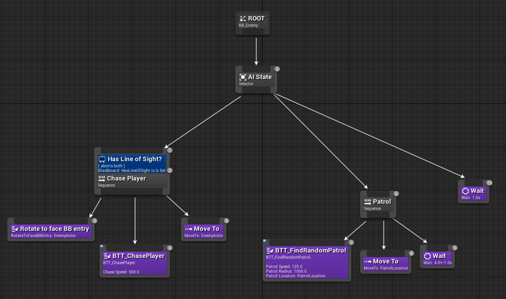
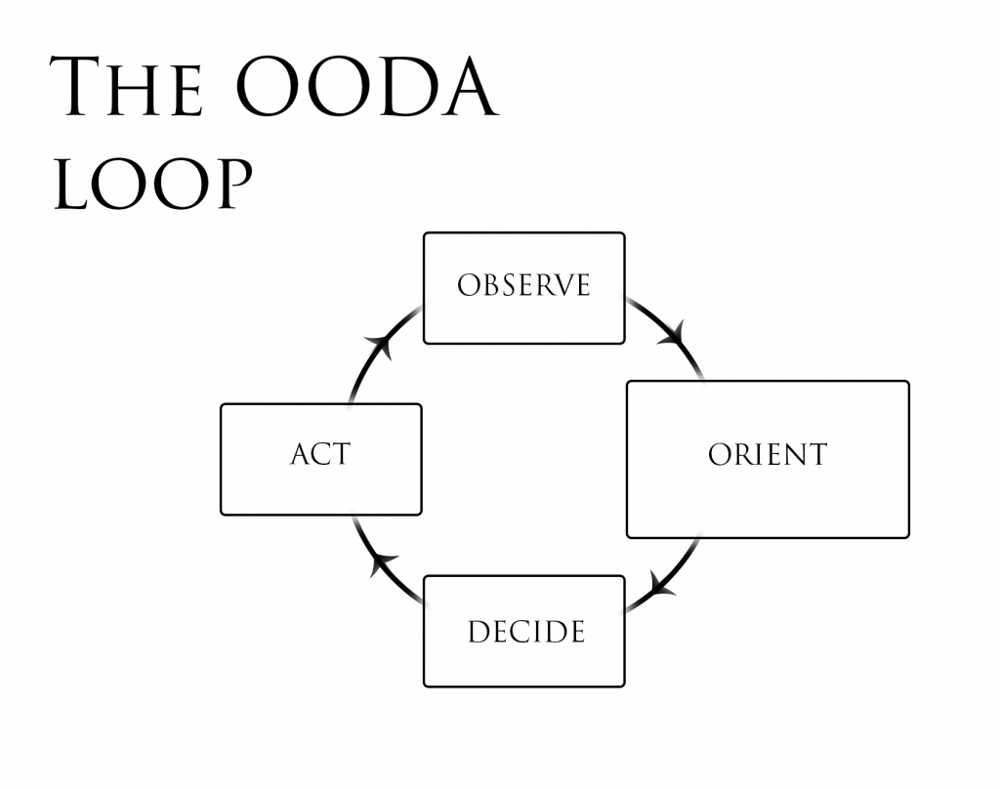

# Video Game AI

A very coarse, practical introduction.

## Disclaimer

The term artificial intelligence (AI) is used to describe a hand-crafted (i.e. scripted) opponent in video games.
In this context, the term is not related to machine learning.

While machine learning can be leveraged to realize video game AI, we have not seen the use of such in commercial products.

## Terminology

- Agent: typically an AI controlled *character / actor*

## Goal

- Entertain the player!
  - Playing the game, adhering to the rules, using the (underlying) mechanics
  - Act natural

## Simple AI

> Castlevania demo

- Can be enough for simple games
- Often requires *design workarounds* to make challenging
- Not very engaging

## Big Picture

> Glass of water

- Emulate human thinking / behavior
- Layers
  - Algorithms at the bottom
  - Strategy at the top
  - Usually 2 layers sufficient

## Bottom Layer (1st)

- Contains very basic building blocks
  - Go to position
  - Interact with object
  - …
- Leverage algorithms

> [Bug Algorithm](https://www.cs.cmu.edu/~motionplanning/lecture/Chap2-Bug-Alg_howie.pdf)

> Dynamite Person Demo

> Over Engineered Demo

> [Overwatch Navmesh](https://youtu.be/W3aieHjyNvw?t=2946)

> [Doom 2016 AI](https://youtu.be/3lO1q8mQrrg?t=1455)

> Project Daredevil Demo 1

> [Project Daredevil Demo 2](https://www.youtube.com/watch?v=pfWpMPXzBj8&list=PL7GgcoHpNOrAZ9LQBF9Rzukov59Qy7eyK&index=8)

## Top Layer

AI needs to:
- be aware of game mechanics;
- interact with game mechanics; and
- use the *meta* of the game.

Meta: The highest level of strategy.

> Diabotical Demo

- Explain general arena FPS concept
- Non-trivial map → positioning
- Different weapons → situational choice
- Pickups → resources!
- Pickups respawn → item timing

→ more about resource management and decision making then just simply shooting each other.

Key concept: **control**
- In-control vs. out-of-control
- Contested control

## Tools

- Bottom layer
  - Graphs
  - Control Theory

- Top layer
  - Behavior trees
  - Decision table
  - Finite state machine
  - Async programming (co-routines)

> https://docs.unrealengine.com/en-US/InteractiveExperiences/ArtificialIntelligence/BehaviorTrees/BehaviorTreesOverview/index.html

## Technique

[OODA Loop](https://en.wikipedia.org/wiki/OODA_loop):
- Observe
- Orient
- Decide
- Act

- [In-depth explanation](https://taylorpearson.me/ooda-loop/)

## Testing

- Handcrafted scenarios with well defined outcome
- AI vs. AI
  - Relate to human vs. human

## Take Home

**Make enemies smarter, not stronger.**

- Good AI keeps the player entertained
  - Can be forgiving (difficulty settings)
- Good AI plays the game similar to how a human plays the game.
- Think in layers → concern yourself with behavior rather than algorithms
- Leverage the OODA loop

- [🎥 AI and Games](https://www.youtube.com/channel/UCov_51F0betb6hJ6Gumxg3Q)
